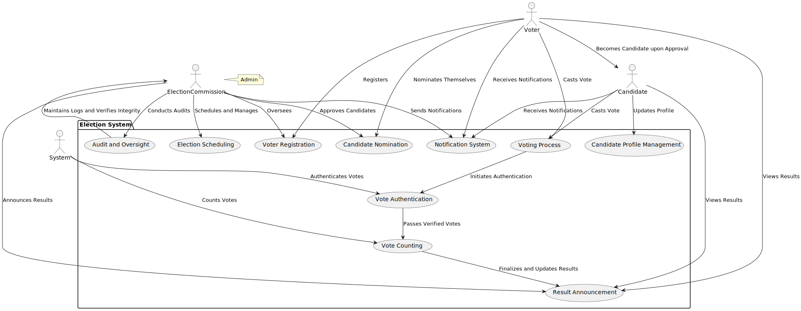
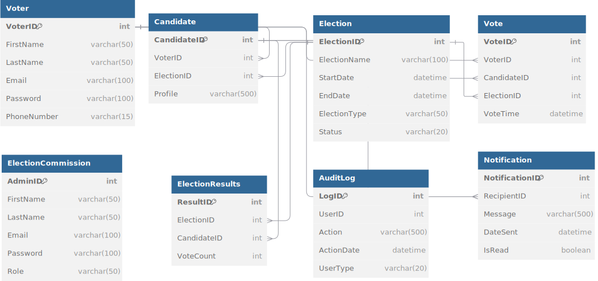

# Election Management System

## Project Name
Election Management System

---

## 1. **Project Name**

**Election System** is an election management software that supports a range of functionalities including voter registration, election scheduling, vote authentication, vote counting, candidate nomination, and result announcement. The system is designed to ensure transparency, integrity, and real-time updates in the election process.

---

## 2. **Problem Statement**

The current election management systems lack sufficient transparency, security, and real-time updates. Additionally, there are often challenges in ensuring the integrity of the voting process, managing voter and candidate information, and providing timely notifications. This project aims to address these challenges by implementing a system that:

- Ensures role-based access control for admins and users.
- Provides real-time vote authentication and counting.
- Sends timely notifications to voters.
- Allows candidates to manage their profiles.
- Includes a robust audit and security feature for accountability.

---

## 3. **Objective**

The objective of the **Election System** is to streamline and secure the election process by providing the following capabilities:

- **Role-based access management**: Ensure that only authorized users (Election Commission/Admin) can perform critical actions such as scheduling elections, approving candidates, and announcing results.
- **Real-time vote authentication and result updates**: Votes are validated in real-time, ensuring only legitimate votes are counted and results are updated dynamically.
- **Notification system**: Voters and candidates are notified of key events such as election schedules, result announcements, and other important updates.
- **Candidate profile management**: Candidates can manage and update their profiles, ensuring accurate and up-to-date information during the election process.
- **Audit and security**: All actions within the system are logged for transparency and integrity, helping prevent tampering and ensuring the fairness of the election.

---

## 4. **Functional and Non-Functional Requirements**

### Functional Requirements:

1. **Voter Registration**: Voters can register in the system to participate in elections.
2. **Election Scheduling**: The Election Commission (Admin) can schedule elections and manage election dates.
3. **Candidate Nomination**: Voters can nominate themselves as candidates, pending approval by the Election Commission.
4. **Vote Casting**: Voters can cast their votes during the election process.
5. **Vote Authentication**: Votes are authenticated in real-time to ensure only valid votes are counted.
6. **Vote Counting**: The system counts votes as they are cast and provides real-time results.
7. **Result Announcement**: The Election Commission announces the results once voting is completed and counted.
8. **Candidate Profile Management**: Candidates can view and update their profiles with relevant information.
9. **Notification System**: Voters receive notifications regarding upcoming elections, results, and other important updates.
10. **Audit and Oversight**: The Election Commission can access audit logs of all system actions to ensure transparency and security.

### Non-Functional Requirements:

1. **Security**: The system must ensure secure authentication and authorization processes, ensuring that only authorized users can perform administrative tasks.
2. **Performance**: The system must be capable of handling real-time voting, vote counting, and result updates without significant delays.
3. **Scalability**: The system should be scalable to handle elections of varying sizes and voter participation levels.
4. **Availability**: The system must be available 24/7, especially during elections, to ensure continuous access for voters.
5. **Usability**: The system should be user-friendly, allowing voters and candidates to easily navigate through registration, voting, and profile management processes.
6. **Reliability**: The system should be reliable, ensuring that votes are accurately counted and results are correctly calculated.
7. **Auditability**: The system should provide detailed logs of all user activities to ensure accountability and transparency in election processes.

---

## Use Case Diagram

---

## Database Diagram

---

## Project Timeline
| Phase               | Tasks                                      | Duration       |
|---------------------|-------------------------------------------|----------------|
| *Requirement Analysis* | Gather requirements, define features.    | 1 day         |
| *Design*           | Create system architecture, UI/UX design. | 1 day        |
| *Development*      | Implement core functionalities.          | 3 days      |
| *Testing*          | Perform functional and security testing. | 1 day        |
| *Deployment*       | Deploy to server and train stakeholders. | 1 day         |

---